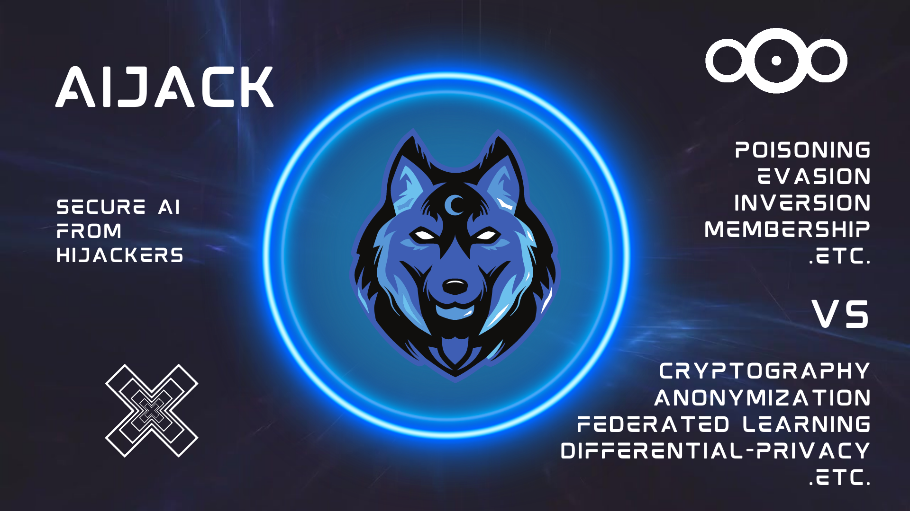

<!--
  Title: AIJack
  Description: AIJack is a fantastic framework demonstrating the security risks of machine learning and deep learning, such as Model Inversion, poisoning attack, and membership inference attack.
  Author: Hideaki Takahashi
  -->

# AIJack: Security and Privacy Risk Simulator for Machine Learning

<div align="left">


</div>

❤️ <i>If you like AIJack, please consider <a href="https://github.com/sponsors/Koukyosyumei">becoming a GitHub Sponsor</a></i> ❤️

<h1 align="center">

  <br>
  
  <br>
  <br>

</h1>

# What is AIJack?

AIJack is an easy-to-use open-source simulation tool for testing the security of your AI system against hijackers. It provides advanced security techniques like *Differential Privacy*, *Homomorphic Encryption*, *K-anonymity* and *Federated Learning* to guarantee protection for your AI. With AIJack, you can test and simulate defenses against various attacks such as *Poisoning*, *Model Inversion*, *Backdoor*, and *Free-Rider*. We support more than 30 state-of-the-art methods. For more information, check our [documentation](https://koukyosyumei.github.io/AIJack/) and start securing your AI today with AIJack.

# Installation

You can install AIJack with `pip`. AIJack requires Boost and pybind11.

```
apt install -y libboost-all-dev
pip install -U pip
pip install "pybind11[global]"

pip install aijack
```

If you want to use the latest-version, you can directly install from GitHub.

```
pip install git+https://github.com/Koukyosyumei/AIJack
```

We also provide [Dockerfile](Dockerfile).


# Quick Start

We briefly introduce the overview of AIJack.

## Features

-   All-around abilities for both attack & defense
-   PyTorch-friendly design
-   Compatible with scikit-learn
-   Fast Implementation with C++ backend
-   MPI-Backend for Federated Learning
-   Extensible modular APIs

## Basic Interface

### Python API

For standard machine learning algorithms, AIJack allows you to simulate attacks against machine learning models with `Attacker` APIs. AIJack mainly supports PyTorch or sklearn models.

```Python
# abstract code

attacker = Attacker(target_model)
result = attacker.attack()
```

For distributed learning such as Federated Learning and Split Learning, AIJack offers four basic APIs: `Client`, `Server`, `API`, and `Manager`. `Client` and `Server` represent each client and server within each distributed learning scheme. You can execute training by registering the clients and servers to `API` and running it. `Manager` gives additional abilities such as attack, defense, or parallel computing to `Client`, `Server` or `API` via `attach` method.

```Python
# abstract code

client = [Client(), Client()]
server = Server()
api = API(client, server)
api.run() # execute training

c_manager = ClientManagerForAdditionalAbility(...)
s_manager = ServerManagerForAdditionalAbility(...)
ExtendedClient = c_manager.attach(Client)
ExtendedServer = c_manager.attach(Server)

extended_client = [ExtendedClient(...), ExtendedClient(...)]
extended_server = ExtendedServer(...)
api = API(extended_client, extended_server)
api.run() # execute training
```

For example, the bellow code implements the scenario where the server in Federated Learning tries to steal the training data with gradient-based model inversion attack.

```Python
from aijack.collaborative.fedavg import FedAVGAPI, FedAVGClient, FedAVGServer
from aijack.attack.inversion import GradientInversionAttackServerManager

manager = GradientInversionAttackServerManager(input_shape)
FedAVGServerAttacker = manager.attach(FedAVGServer)

clients = [FedAVGClient(model_1), FedAVGClient(model_2)]
server = FedAVGServerAttacker(clients, model_3)

api = FedAVGAPI(server, clients, criterion, optimizers, dataloaders)
api.run()
```

### AIValut: A simple DBMS for debugging ML Models

We also provide a simple DBMS named `AIValut` designed specifically for SQL-based algorithms. AIValut currently supports Rain, a SQL-based debugging system for ML models. In the future, we have plans to integrate additional advanced features from AIJack, including K-Anonymity, Homomorphic Encryption, and Differential Privacy. 

AIValut has its own storage engine and query parser, and you can train and debug ML models with SQL-like queries. For example, the `Complaint` query automatically removes problematic records given the specified constraint.

```sql
# We train an ML model to classify whether each customer will go bankrupt or not based on their age and debt.
# We want the trained model to classify the customer as positive when he/she has more debt than or equal to 100.
# The 10th record seems problematic for the above constraint.
>>Select * From bankrupt
id age debt y
1 40 0 0
2 21 10 0
3 22 10 0
4 32 30 0
5 44 50 1
6 30 100 1
7 63 310 1
8 53 420 1
9 39 530 1
10 49 1000 0

# Train Logistic Regression with the number of iterations of 100 and the learning rate of 1.
# The name of the target feature is `y`, and we use all other features as training data.
>>Logreg lrmodel id y 100 1 From Select * From bankrupt
Trained Parameters:
 (0) : 2.771564
 (1) : -0.236504
 (2) : 0.967139
AUC: 0.520000
Prediction on the training data is stored at `prediction_on_training_data_lrmodel`

# Remove one record so that the model will predict `positive (class 1)` for the samples with `debt` greater or equal to 100.
>>Complaint comp Shouldbe 1 Remove 1 Against Logreg lrmodel id y 100 1 From Select * From bankrupt Where debt Geq 100
Fixed Parameters:
 (0) : -4.765492
 (1) : 8.747224
 (2) : 0.744146
AUC: 1.000000
Prediction on the fixed training data is stored at `prediction_on_training_data_comp_lrmodel`
```

For more detailed information and usage instructions, please refer to [aivalut/README.md](aivalut/README.md).

> Please use AIValut only for research purpose. 

## Resources

You can also find more examples in our tutorials and documentation.

-   [Examples](docs/source/notebooks)
-   [Documentation](https://koukyosyumei.github.io/AIJack/)
-   [API Reference](https://koukyosyumei.github.io/AIJack/api.html)

# Supported Algorithms

|               |                        |                                                                                                                                                                                                                                                                                                                                                                                                                                                                                                                                                                  |
| ------------- | ---------------------- | ---------------------------------------------------------------------------------------------------------------------------------------------------------------------------------------------------------------------------------------------------------------------------------------------------------------------------------------------------------------------------------------------------------------------------------------------------------------------------------------------------------------------------------------------------------------- |
| Collaborative | Horizontal FL          | [FedAVG](https://arxiv.org/abs/1602.05629), [FedProx](https://arxiv.org/abs/1812.06127), [FedKD](https://arxiv.org/abs/2108.13323), [FedGEMS](https://arxiv.org/abs/2110.11027), [FedMD](https://arxiv.org/abs/1910.03581), [DSFL](https://arxiv.org/abs/2008.06180), [MOON](https://arxiv.org/abs/2103.16257), [FedExP](https://arxiv.org/abs/2301.09604)                                                                                                                                                                                                                                                                                             |
| Collaborative | Vertical FL            | [SplitNN](https://arxiv.org/abs/1812.00564), [SecureBoost](https://arxiv.org/abs/1901.08755)                                                                                                                                                                                                                                                                                                                                                                                                                                                                     |
| Attack        | Model Inversion        | [MI-FACE](https://dl.acm.org/doi/pdf/10.1145/2810103.2813677), [DLG](https://papers.nips.cc/paper/2019/hash/60a6c4002cc7b29142def8871531281a-Abstract.html), [iDLG](https://arxiv.org/abs/2001.02610), [GS](https://proceedings.neurips.cc/paper/2020/hash/c4ede56bbd98819ae6112b20ac6bf145-Abstract.html), [CPL](https://arxiv.org/abs/2004.10397), [GradInversion](https://openaccess.thecvf.com/content/CVPR2021/papers/Yin_See_Through_Gradients_Image_Batch_Recovery_via_GradInversion_CVPR_2021_paper.pdf), [GAN Attack](https://arxiv.org/abs/1702.07464) |
| Attack        | Label Leakage          | [Norm Attack](https://arxiv.org/abs/2102.08504)                                                                                                                                                                                                                                                                                                                                                                                                                                                                                                                  |
| Attack        | Poisoning              | [History Attack](https://arxiv.org/abs/2203.08669), [Label Flip](https://arxiv.org/abs/2203.08669), [MAPF](https://arxiv.org/abs/2203.08669), [SVM Poisoning](https://arxiv.org/abs/1206.6389)                                                                                                                                                                                                                                                                                                                                                                   |
| Attack        | Backdoor               | [DBA](https://openreview.net/forum?id=rkgyS0VFvr), [Model Replacement](https://proceedings.mlr.press/v108/bagdasaryan20a.html)                                                                                                                                                                                                                                                                                                                                                                                                                                                                                                                |
| Attack        | Free-Rider             | [Delta-Weight](https://arxiv.org/pdf/1911.12560.pdf)                                                                                                                                                                                                                                                                                                                                                                                                                                                                                                             |
| Attack        | Evasion                | [Gradient-Descent Attack](https://arxiv.org/abs/1708.06131), [FGSM](https://arxiv.org/abs/1412.6572), [DIVA](https://arxiv.org/abs/2204.10933)                                                                                                                                                                                                                                                                                                                                                                                                                                                                                                      |
| Attack        | Membership Inference   | [Shaddow Attack](https://arxiv.org/abs/1610.05820)                                                                                                                                                                                                                                                                                                                                                                                                                                                                                                               |
| Defense       | Homomorphic Encryption | [Paillier](https://link.springer.com/chapter/10.1007/3-540-48910-X_16)                                                                                                                                                                                                                                                                                                                                                                                                                                             |
| Defense       | Differential Privacy   | [DPSGD](https://arxiv.org/abs/1607.00133), [AdaDPS](https://arxiv.org/pdf/2202.05963.pdf), [DPlis](https://arxiv.org/pdf/2103.01496.pdf)                                                                                                                                                                                                                                                                                                                                                                                                                                                                        |
| Defense       | Anonymization          | [Mondrian](https://ieeexplore.ieee.org/document/1617393)                                                                                                                                                                                                                                                                                                                                                                                                                                                                                                         |
| Defense       | Robust Training   | [PixelDP](https://arxiv.org/abs/1802.03471v4), [Cost-Aware Robust Tree Ensemble](https://arxiv.org/abs/1912.01149) |
| Defense       | Debugging              | [Model Assertions](https://cs.stanford.edu/~matei/papers/2019/debugml_model_assertions.pdf), [Rain](https://arxiv.org/abs/2004.05722), [Neuron Coverage](https://dl.acm.org/doi/abs/10.1145/3132747.3132785) |
| Defense       | Others                 | [Soteria](https://openaccess.thecvf.com/content/CVPR2021/papers/Sun_Soteria_Provable_Defense_Against_Privacy_Leakage_in_Federated_Learning_From_CVPR_2021_paper.pdf), [FoolsGold](https://arxiv.org/abs/1808.04866), [MID](https://arxiv.org/abs/2009.05241), [Sparse Gradient](https://aclanthology.org/D17-1045/)                                                                                                                                                                                                                                              |

-----------------------------------------------------------------------

# Citation

```
@misc{Hideaki_AIJack_2023,
  author = {Hideaki, Takahashi},
  title = {AIJack},
  year = {2023},
  publisher = {GitHub},
  journal = {GitHub Repository},
  howpublished = {\url{https://github.com/Koukyosyumei/AIJack}},
}
```

# Related Publications

Below you can find a list of papers and books that either use or extend AIJack.

- Song, Junzhe, and Dmitry Namiot. "A Survey of the Implementations of Model Inversion Attacks." International Conference on Distributed Computer and Communication Networks. Cham: Springer Nature Switzerland, 2022.
- Kapoor, Amita, and Sharmistha Chatterjee. Platform and Model Design for Responsible AI: Design and build resilient, private, fair, and transparent machine learning models. Packt Publishing Ltd, 2023.
- Mi, Yuxi, et al. "Flexible Differentially Private Vertical Federated Learning with Adaptive Feature Embeddings." arXiv preprint arXiv:2308.02362 (2023).
- Mohammadi, Mohammadreza, et al. "Privacy-preserving Federated Learning System for Fatigue Detection." 2023 IEEE International Conference on Cyber Security and Resilience (CSR). IEEE, 2023.

# Contact

welcome2aijack[@]gmail.com
