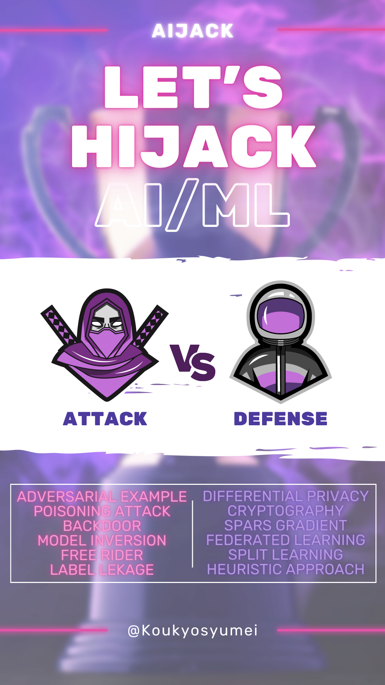

<!--
  Title: AIJack
  Description: AIJack is a fantastic framework demonstrating the security risks of machine learning and deep learning, such as Model Inversion, poisoning attack, and membership inference attack.
  Author: Hideaki Takahashi
  -->

# AIJack: Security and Privacy Risk Simulator for Machine Learning

<div align="left">


</div>

❤️ <i>If you like AIJack, please consider <a href="https://github.com/sponsors/Koukyosyumei">becoming a GitHub Sponsor</a></i> ❤️

# What is AIJack?



AIJack is an easy-to-use open-source simulation tool for testing the security of your AI system against hijackers. It provides advanced security techniques like *Differential Privacy*, *Homomorphic Encryption*, and *Federated Learning* to guarantee protection for your AI. With AIJack, you can test and simulate defenses against various attacks such as *Poisoning*, *Model Inversion*, *Backdoor*, and *Free-Rider*. We currently implement more than 30 state-of-the-art methods. For more information, check our [documentation](https://koukyosyumei.github.io/AIJack/intro.html) and start securing your AI today with AIJack.

# Installation

You can install AIJack with `pip`. AIJack requires Boost and pybind11.

```
apt install -y libboost-all-dev
pip install -U pip
pip install "pybind11[global]"

pip install aijack
```

If you want to use the latest-version, you can directly install from GitHub.

```
pip install git+https://github.com/Koukyosyumei/AIJack
```

We also provide [Dockerfile](Dockerfile).


# Quick Start

We briefly introduce the overview of AIJack.

## Features

- All-around abilities for both attack & defense
- PyTorch-friendly design
- Compatible with scikit-learn
- Fast Implementation with C++ backend
- MPI-Backend for Federated Learning
- Extensible modular APIs

## Basic Interface

For standard machine learning algorithms, AIJack allows you to simulate attacks against machine learning models with `Attacker` APIs. AIJack mainly supports PyTorch or sklearn models.

```Python
# abstract code

attacker = Attacker(target_model)
result = attacker.attack()
```

For distributed learning such as Federated Learning and Split Learning, AIJack offers four basic APIs: `Client`, `Server`, `API`, and `Manager`. `Client` and `Server` represent each client and server within each distributed learning scheme. You can execute training by registering the clients and servers to `API` and running it. `Manager` gives additional abilities such as attack, defense, or parallel computing to `Client`, `Server` or `API` via `attach` method.

```Python
# abstract code

client = [Client(), Client()]
server = Server()
api = API(client, server)
api.run() # execute training

c_manager = ClientManagerForAdditionalAbility(...)
s_manager = ServerManagerForAdditionalAbility(...)
ExtendedClient = c_manager.attach(Client)
ExtendedServer = c_manager.attach(Server)

extended_client = [ExtendedClient(...), ExtendedClient(...)]
extended_server = ExtendedServer(...)
api = API(extended_client, extended_server)
api.run() # execute training
```

For example, the bellow code implements the scenario where the server in Federated Learning tries to steal the training data with model inversion attack, and one client aims to mitigate this attack with differential privacy.

```Python
from aijack.collaborative.fedavg import FedAVGClient, FedAVGServer, FedAVGAPI
from aijack.defense.dp import DPSGDClientManager

manager = DPSGDClientManager(...)
DPSGDFedAVGClient = manager.attach(FedAVGClient)

manager = GradientInversionAttackServerManager(...)
GradientInversionAttackFedAVGServer = manager.attach(FedAVGServer)


clients = [FedAVGClient(...), DPSGDFedAVGClient(...)]
server = GradientInversionAttackFedAVGServer(...)

api = FedAVGAPI(extended_client, extended_server)
api.run()
```

## Resources

You can also find more examples in our tutorials and documentation.

- [Blog](https://dev.to/koukyosyumei/privacy-preserving-machine-learning-with-aijack-1-federated-learning-on-pytorch-3i5m)
- [Documentation](https://koukyosyumei.github.io/AIJack/intro.html)
- [API Reference](https://koukyosyumei.github.io/AIJack/api/index.html)

# Supported Algorithms

|               |                        |                                                                                                                                                                                                                                                                                                                                                                                                                                                                                                                                                                  |
| ------------- | ---------------------- | ---------------------------------------------------------------------------------------------------------------------------------------------------------------------------------------------------------------------------------------------------------------------------------------------------------------------------------------------------------------------------------------------------------------------------------------------------------------------------------------------------------------------------------------------------------------- |
| Collaborative | Horizontal FL          | [FedAVG](https://arxiv.org/abs/1602.05629), [FedProx](https://arxiv.org/abs/1812.06127), [FedMD](https://arxiv.org/abs/2108.13323), [FedGEMS](https://arxiv.org/abs/2110.11027), [DSFL](https://arxiv.org/abs/2008.06180)                                                                                                                                                                                                                                                                                                                                        |
| Collaborative | Vertical FL            | [SplitNN](https://arxiv.org/abs/1812.00564), [SecureBoost](https://arxiv.org/abs/1901.08755)                                                                                                                                                                                                                                                                                                                                                                                                                                                                     |
| Attack        | Model Inversion        | [MI-FACE](https://dl.acm.org/doi/pdf/10.1145/2810103.2813677), [DLG](https://papers.nips.cc/paper/2019/hash/60a6c4002cc7b29142def8871531281a-Abstract.html), [iDLG](https://arxiv.org/abs/2001.02610), [GS](https://proceedings.neurips.cc/paper/2020/hash/c4ede56bbd98819ae6112b20ac6bf145-Abstract.html), [CPL](https://arxiv.org/abs/2004.10397), [GradInversion](https://openaccess.thecvf.com/content/CVPR2021/papers/Yin_See_Through_Gradients_Image_Batch_Recovery_via_GradInversion_CVPR_2021_paper.pdf), [GAN Attack](https://arxiv.org/abs/1702.07464) |
| Attack        | Label Leakage          | [Norm Attack](https://arxiv.org/abs/2102.08504)                                                                                                                                                                                                                                                                                                                                                                                                                                                                                                                  |
| Attack        | Poisoning              | [History Attack](https://arxiv.org/abs/2203.08669), [Label Flip](https://arxiv.org/abs/2203.08669), [MAPF](https://arxiv.org/abs/2203.08669), [SVM Poisoning](https://arxiv.org/abs/1206.6389)                                                                                                                                                                                                                                                                                                                                                                   |
| Attack        | Backdoor               | [DBA](https://openreview.net/forum?id=rkgyS0VFvr)                                                                                                                                                                                                                                                                                                                                                                                                                                                                                                                |
| Attack        | Free-Rider             | [Delta-Weight](https://arxiv.org/pdf/1911.12560.pdf)                                                                                                                                                                                                                                                                                                                                                                                                                                                                                                             |
| Attack        | Evasion                | [Gradient-Descent Attack](https://arxiv.org/abs/1708.06131)                                                                                                                                                                                                                                                                                                                                                                                                                                                                                                      |
| Attack        | Membership Inference   | [Shaddow Attack](https://arxiv.org/abs/1610.05820)                                                                                                                                                                                                                                                                                                                                                                                                                                                                                                               |
| Defense       | Homomorphic Encryption | [Paiilier](https://link.springer.com/chapter/10.1007/3-540-48910-X_16), [CKKS](https://eprint.iacr.org/2016/421.pdf)                                                                                                                                                                                                                                                                                                                                                                                                                                             |
| Defense       | Differential Privacy   | [DPSGD](https://arxiv.org/abs/1607.00133)                                                                                                                                                                                                                                                                                                                                                                                                                                                                                                                        |
| Defense       | Others                 | [Soteria](https://openaccess.thecvf.com/content/CVPR2021/papers/Sun_Soteria_Provable_Defense_Against_Privacy_Leakage_in_Federated_Learning_From_CVPR_2021_paper.pdf), [FoolsGold](https://arxiv.org/abs/1808.04866), [MID](https://arxiv.org/abs/2009.05241), [Sparse Gradient](https://aclanthology.org/D17-1045/)                                                                                                                                                                                                                                              |

-----------------------------------------------------------------------

# Contact

welcome2aijack[@]gmail.com
