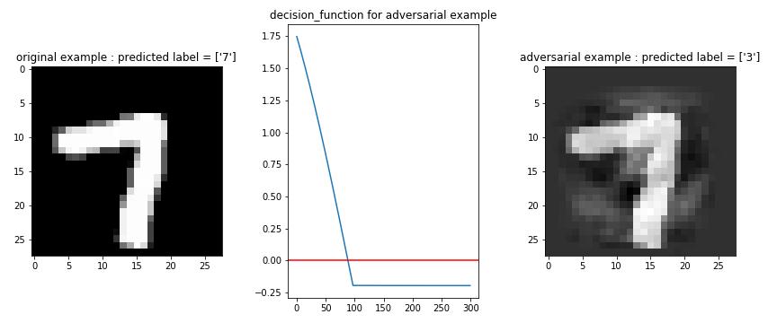
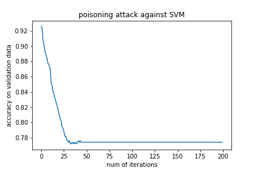
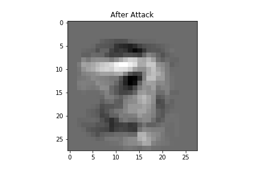

# secure machine learning

## 1. membership inference

I created a notebook that demonstrates the membership inference based on the following paper

https://arxiv.org/abs/1610.05820

The bellow table shows the result of experiment, where I use SVM as target model, shadow model,
and attack model on MNIST.

        c = 0
        overall f1 score is  0.706983441324694
                      precision    recall  f1-score   support

                   0       0.20      0.92      0.33       111
                   1       0.98      0.55      0.71       889

            accuracy                           0.59      1000
           macro avg       0.59      0.74      0.52      1000
        weighted avg       0.90      0.59      0.67      1000

## 2. Evasion Attack
I tested the experiment described in the below paper.

https://arxiv.org/abs/1708.06131

Although the author created adversarial examples against SVM with linear kernel,\
I also implemented the attacker against RBF and poly kernel.
The target model is SVM with the RBF kernel which is trained for binary classification
between "3" and "7" of mnist.
The performance of the model is as follows.

                  precision    recall  f1-score   support

               3       0.99      0.99      0.99       229
               7       0.99      0.99      0.99       271

        accuracy                           0.99       500
       macro avg       0.99      0.99      0.99       500
    weighted avg       0.99      0.99      0.99       500

I created an adversarial example which seems "7" for human, but svm can't correctly classify. The result is shown in the following picture.

The usage of my code is really simple.

        example

            # datasets which contains only "3"
            X_minus_1 = X_train[np.where(y_train == "3")]

            # Attack_sklearn automatically detect the type of the classifier
            attacker = Attack_sklearn(clf = clf, X_minus_1 = X_minus_1,
                                      dmax =  (5000 / 255) * 2.5,
                                      max_iter = 300,
                                      gamma = 1 / (X_train.shape[1] * np.var(X_train)),
                                      lam = 10, t = 0.5, h = 10)

            # x0 is the intial ponint ("7")
            xm, log = attacker.attack(x0)

## 3. Poisoning Attack

Second, I implemented a "poisoning attack" against SVM with a linear kernel.
The data set is the same as section 1, and I referred to the following paper.
https://arxiv.org/abs/1206.6389

You can see that adding only one poisoned image dramatically decreases the accuracy of SVM.

The usage of my code is as follows.

        example

            attacker = Poison_attack_sklearn(clf,
                                            X_train_, y_train_,
                                            t=0.5)

            xc_attacked, log = attacker.attack(xc, 1,
                                            X_valid, y_valid_,
                                            num_iterations=200)

