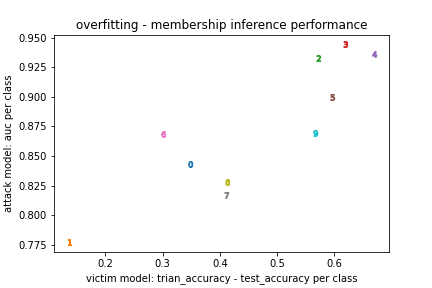

# Membershio Inference

I tested my implementation on CIFAR10 and got similar results described in the paper. I sampled 2000 data as training data for the target model, 2000 data as validation data for the target model, and 4000 data for the shadow model. The overall auc of attack model, which predict whether or not the specific data was used for the training of target model, is 0.850.
The figure shows the performance of the target model and attack model. x axis represents the accuracy of target model for training data minus the accuracy of target model for test data. y axis means the auc of attack model. As the paper says, you can see that
overfitting can be the main factor for the success of membership inference.

