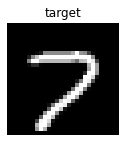
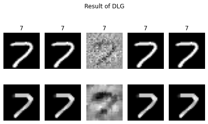
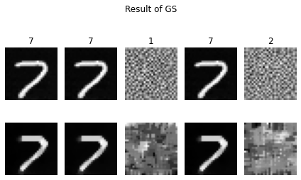
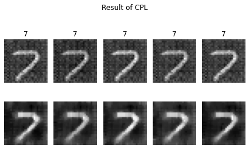
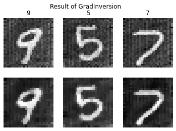

```python
import cv2
import copy
import torch
import torch.nn as nn
import torchvision
import torchvision.transforms as transforms
from matplotlib import pyplot as plt
from tqdm.notebook import tqdm

from aijack.attack import GradientInversion_Attack
from aijack.utils import NumpyDataset
```


```python
class LeNet(nn.Module):
    def __init__(self, channel=3, hideen=768, num_classes=10):
        super(LeNet, self).__init__()
        act = nn.Sigmoid
        self.body = nn.Sequential(
            nn.Conv2d(channel, 12, kernel_size=5, padding=5 // 2, stride=2),
            nn.BatchNorm2d(12),
            act(),
            nn.Conv2d(12, 12, kernel_size=5, padding=5 // 2, stride=2),
            nn.BatchNorm2d(12),
            act(),
            nn.Conv2d(12, 12, kernel_size=5, padding=5 // 2, stride=1),
            nn.BatchNorm2d(12),
            act(),
        )
        self.fc = nn.Sequential(
            nn.Linear(hideen, num_classes)
        )

    def forward(self, x):
        out = self.body(x)
        out = out.view(out.size(0), -1)
        out = self.fc(out)
        return out
```


```python
def prepare_dataloader(path="MNIST/.", batch_size = 64, shuffle=True):
    at_t_dataset_train = torchvision.datasets.MNIST(
        root=path, train=True, download=True
    )

    transform = transforms.Compose(
        [transforms.ToTensor(), transforms.Normalize((0.5,), (0.5,))]
    )

    dataset = NumpyDataset(
        at_t_dataset_train.train_data.numpy(),
        at_t_dataset_train.train_labels.numpy(),
        transform=transform,
    )

    dataloader = torch.utils.data.DataLoader(
        dataset, batch_size=batch_size, shuffle=shuffle, num_workers=0
    )
    return dataloader
```


```python
torch.manual_seed(1)

shape_img = (28, 28)
num_classes = 10
channel = 1
hidden = 588

device = torch.device("cuda:0") if torch.cuda.is_available() else "cpu"
dataloader = prepare_dataloader()
for data in dataloader:
    x, y = data[0], data[1]
    break
```

    Files already downloaded


## DLG Attack

https://dlg.mit.edu/assets/NeurIPS19_deep_leakage_from_gradients.pdf

- distance metric = L2 norm
- optimize both of images and labels


```python
plt.figure(figsize=(2, 4))
plt.imshow(x[:1].detach().numpy()[0][0], cmap="gray")
plt.axis("off")
plt.title("target")
plt.show()

criterion = nn.CrossEntropyLoss()
net = LeNet(channel=channel, hideen=hidden, num_classes=num_classes)
pred = net(x[:1])
loss = criterion(pred, y[:1])
received_gradients = torch.autograd.grad(loss, net.parameters())
received_gradients = [cg.detach() for cg in received_gradients]

dlg_attacker = GradientInversion_Attack(net, (1, 28, 28), lr=1.0, log_interval=0,
                                    num_iteration=100,
                                    distancename="l2")

num_seeds=5
fig = plt.figure()
for s in tqdm(range(num_seeds)):
    dlg_attacker.reset_seed(s)
    result = dlg_attacker.attack(received_gradients)
    ax1 = fig.add_subplot(2, num_seeds, s+1)
    ax1.imshow(result[0].detach().numpy()[0][0], cmap="gray")
    ax1.set_title(torch.argmax(result[1]).item())
    ax1.axis("off")
    ax2 = fig.add_subplot(2, num_seeds, num_seeds+s+1)
    ax2.imshow(cv2.medianBlur(result[0].detach().numpy()[0][0], 5), cmap="gray")
    ax2.axis("off")
plt.suptitle("Result of DLG")
plt.tight_layout()
plt.show()
```





      0%|          | 0/5 [00:00<?, ?it/s]





## GS Attack

https://arxiv.org/abs/2003.14053

- distance metric = cosine similarity
- optimize both of images and labels
- total\-variance regularization


```python
plt.figure(figsize=(2, 4))
plt.imshow(x[:1].detach().numpy()[0][0], cmap="gray")
plt.axis("off")
plt.title("target")
plt.show()

criterion = nn.CrossEntropyLoss()
net = LeNet(channel=channel, hideen=hidden, num_classes=num_classes)
pred = net(x[:1])
loss = criterion(pred, y[:1])
received_gradients = torch.autograd.grad(loss, net.parameters())
received_gradients = [cg.detach() for cg in received_gradients]

gs_attacker = GradientInversion_Attack(net, (1, 28, 28), lr=1.0, log_interval=0,
                                    num_iteration=100,
                                    tv_reg_coef=0.01,
                                    distancename="cossim")

num_seeds=5
fig = plt.figure()
for s in tqdm(range(num_seeds)):
    gs_attacker.reset_seed(s)
    result = gs_attacker.attack(received_gradients)
    ax1 = fig.add_subplot(2, num_seeds, s+1)
    ax1.axis("off")
    ax1.imshow(result[0].detach().numpy()[0][0], cmap="gray")
    ax1.set_title(torch.argmax(result[1]).item())
    ax2 = fig.add_subplot(2, num_seeds, num_seeds+s+1)
    ax2.imshow(cv2.medianBlur(result[0].detach().numpy()[0][0], 5), cmap="gray")
    ax2.axis("off")
plt.suptitle("Result of GS")
plt.tight_layout()
plt.show()
```


      0%|          | 0/5 [00:00<?, ?it/s]





## iDLG Attack

https://arxiv.org/abs/2001.02610

- distance metric = L2 norm
- optimize only an image & estimate a label from the gradients


```python
plt.figure(figsize=(2, 4))
plt.imshow(x[:1].detach().numpy()[0][0], cmap="gray")
plt.axis("off")
plt.title("target")
plt.show()

criterion = nn.CrossEntropyLoss()
net = LeNet(channel=channel, hideen=hidden, num_classes=num_classes)
pred = net(x[:1])
loss = criterion(pred, y[:1])
received_gradients = torch.autograd.grad(loss, net.parameters())
received_gradients = [cg.detach() for cg in received_gradients]

gs_attacker = GradientInversion_Attack(net, (1, 28, 28), lr=1.0, log_interval=0,
                                    num_iteration=100,
                                    distancename="cossim")

idlg_attacker = GradientInversion_Attack(net, (1, 28, 28), lr=10e2, log_interval=0,
                                    optimizer_class=torch.optim.SGD,
                                    distancename="l2", optimize_label=False,
                                    num_iteration=1000)

num_seeds=5
fig = plt.figure()
for s in tqdm(range(num_seeds)):
    idlg_attacker.reset_seed(s)
    result = idlg_attacker.attack(received_gradients)
    ax1 = fig.add_subplot(2, num_seeds, s+1)
    ax1.imshow(result[0].detach().numpy()[0][0], cmap="gray")
    ax1.axis("off")
    ax1.set_title(result[1].item())
    ax2 = fig.add_subplot(2, num_seeds, num_seeds+s+1)
    ax2.imshow(cv2.medianBlur(result[0].detach().numpy()[0][0], 5), cmap="gray")
    ax2.axis("off")
plt.suptitle("Result of iDLG")
plt.tight_layout()
plt.show()
```


      0%|          | 0/5 [00:00<?, ?it/s]


## CPL Attack

https://arxiv.org/abs/2004.10397

- distance metric = L2 norm
- optimize only images & estimate an label from the gradients
- label\-matching regularization


```python
plt.figure(figsize=(2, 4))
plt.imshow(x[:1].detach().numpy()[0][0], cmap="gray")
plt.axis("off")
plt.title("target")
plt.show()

criterion = nn.CrossEntropyLoss()
net = LeNet(channel=channel, hideen=hidden, num_classes=num_classes)
pred = net(x[:1])
loss = criterion(pred, y[:1])
received_gradients = torch.autograd.grad(loss, net.parameters())
received_gradients = [cg.detach() for cg in received_gradients]

cpl_attacker = GradientInversion_Attack(net, (1, 28, 28), lr=10e2, log_interval=0,
                                    optimizer_class=torch.optim.SGD,
                                    distancename="l2", optimize_label=False,
                                    num_iteration=1000,
                                    lm_reg_coef=0.01)

num_seeds=5
fig = plt.figure()
for s in tqdm(range(num_seeds)):
    idlg_attacker.reset_seed(s)
    result = cpl_attacker.attack(received_gradients)
    ax1 = fig.add_subplot(2, num_seeds, s+1)
    ax1.imshow(result[0].detach().numpy()[0][0], cmap="gray")
    ax1.axis("off")
    ax1.set_title(result[1].item())
    ax2 = fig.add_subplot(2, num_seeds, num_seeds+s+1)
    ax2.imshow(cv2.medianBlur(result[0].detach().numpy()[0][0], 5), cmap="gray")
    ax2.axis("off")
plt.suptitle("Result of CPL")
plt.tight_layout()
plt.show()
```


      0%|          | 0/5 [00:00<?, ?it/s]





## GradInversion

https://arxiv.org/abs/2104.07586

- distance metric = L2 norm
- optimize only images & estimate labels from the gradients
- total\-variance, l2, bn, and group\-consistency regularization


```python
batch_size = 3

fig = plt.figure(figsize=(3, 2))
for bi in range(batch_size):
    ax = fig.add_subplot(1, batch_size, bi+1)
    ax.imshow(x[bi].detach().numpy()[0], cmap="gray")
    ax.axis("off")
plt.suptitle("target")
plt.tight_layout()
plt.show()

criterion = nn.CrossEntropyLoss()
net = LeNet(channel=channel, hideen=hidden, num_classes=num_classes)
pred = net(x[:batch_size])
loss = criterion(pred, y[:batch_size])
received_gradients = torch.autograd.grad(loss, net.parameters())
received_gradients = [cg.detach() for cg in received_gradients]

gradinversion = GradientInversion_Attack(net, (1, 28, 28), num_iteration=1000,
                                    lr=1e2, log_interval=0,
                                    optimizer_class=torch.optim.SGD,
                                    distancename="l2", optimize_label=False,
                                    bn_reg_layers=[net.body[1], net.body[4], net.body[7]],
                                    group_num = 5,
                                    tv_reg_coef=0.00, l2_reg_coef=0.0001,
                                    bn_reg_coef=0.001, gc_reg_coef=0.001)

result = gradinversion.group_attack(received_gradients, batch_size=batch_size)

fig = plt.figure()
for bid in range(batch_size):
    ax1 = fig.add_subplot(2, batch_size, bid+1)
    ax1.imshow((sum(result[0]) / len(result[0])).detach().numpy()[bid][0], cmap="gray")
    ax1.axis("off")
    ax1.set_title(result[1][0][bid].item())
    ax2 = fig.add_subplot(2, batch_size, batch_size+bid+1)
    ax2.imshow(cv2.medianBlur((sum(result[0]) / len(result[0])).detach().numpy()[bid][0], 3), cmap="gray")
    ax2.axis("off")

plt.suptitle("Result of GradInversion")
```


    Text(0.5, 0.98, 'Result of GradInversion')





```python

```
